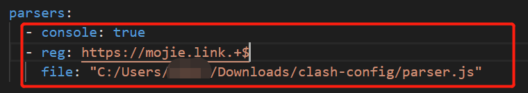

# 使用

*我使用的是汉化的，但是位置一样*

**分流规则使用[clash-rules](https://github.com/Loyalsoldier/clash-rules)**

## 1.编辑配置

### 设置-预处理配置

### 2.在配置文件中添加配置

*注意yml格式。在：后面有一个空格*  
console:是否开启日志，如果不是开发者就不需要这个配置  
reg:正则匹配，可以换成其他网址  
file:parser.js的路径，替换成自己电脑的即可  

### 3.更新订阅

关闭第一步打开的配置文件后，直接去更新订阅即可。

### 4.查看转换后的订阅

